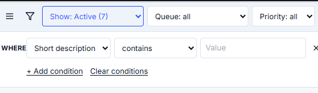
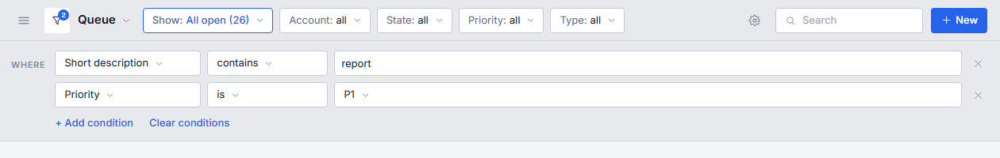
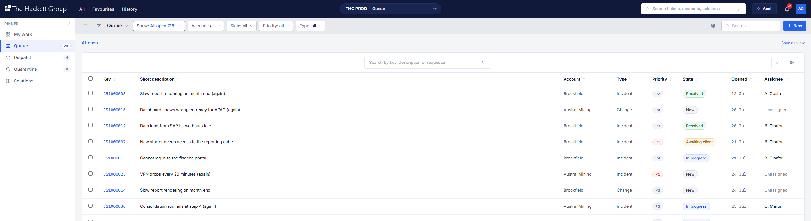
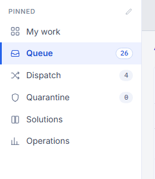

# The v3 fidelity pass

What changed, screen by screen, against `01-architecture/wireframes/v3/` and
`01-architecture/WIREFRAMES.md` sections 2, 4 and 8, and what still differs.

Screenshots are outside git, in `C:/Users/matt.brown/Documents/repos/xms-work/shots-v3/`
for pass one and `.../shots-v3-pass2/` for pass two, at the prototype's own
1500 by 1020. Before shots are the stack as the reviewer was running it; after
shots are this branch on a dev server of its own.

## Hand-off reconciliation (pass two)

Pass one measured the renders off the PNGs because the prototype file
(`XMS-v3-standalone.html`) is a bundler page with a base64 payload rather than
readable markup. Two things changed that for pass two:

1. **The payload unpacks.** The `__bundler/template` script in that file is a
   JSON string holding the whole rendered page with its inline styles, and the
   `__bundler/manifest` script holds the gzipped assets. Unpacking it gives the
   prototype's own literals, not a pixel estimate: it is the source every
   measurement below is now taken from.
2. **The design hand-off arrived**
   (`01-architecture/wireframes/v3/handoff/`): `XMS-UI-SPEC.md` and
   `xms-ui.css`, which the spec names as the source of truth for the build.
   Where the hand-off and pass one's measurement disagree, the hand-off wins.

What changed as a result, value by value:

| Token or rule                             | Pass one                                        | Now                                                                                                                      | Source                                                            |
| ----------------------------------------- | ----------------------------------------------- | ------------------------------------------------------------------------------------------------------------------------ | ----------------------------------------------------------------- |
| `--xms-bar` (the grey tool strip)         | `#F0F3FA`                                       | `#E7E9ED`                                                                                                                | `xms-ui.css` `--xms-toolstrip`; the render's own pixels agree     |
| The strip's rule                          | `--xms-line` `#E4E8F5`                          | `--xms-bar-line` `#CFD5DF`                                                                                               | `--xms-toolstrip-edge`                                            |
| The page canvas                           | not painted, so the body's white showed through | `--xms-bg` `#F4F5F7` on the scrolling column                                                                             | `.xms-main { background: var(--xms-canvas) }`                     |
| Row divider                               | `--xms-line` `#E4E8F5`                          | `--xms-line-row` `#EEF1F6`                                                                                               | `.xms-table td`                                                   |
| Table header underline                    | `--xms-line` `#E4E8F5`                          | `--xms-line-head` `#D5DBE5`                                                                                              | `.xms-table th`                                                   |
| Row hover                                 | `--xms-row-hover` `#F7F8FA`                     | `#F0F3FA`                                                                                                                | `.xms-table tbody tr:hover`, hand-off section 7                   |
| Toolbar control edge                      | `--xms-line` `#E4E8F5`                          | `--xms-control-line` `#C3CAD6`                                                                                           | `--xms-line-control`                                              |
| Dashed "Add filter" edge, idle sort glyph | `--xms-line-strong` / `--xms-muted`             | `--xms-quiet-line` `#B4BDCC`                                                                                             | `.xms-chip.is-add`, hand-off section 5                            |
| Toolbar pill radius                       | `999px`                                         | `4px` (`--xms-radius-control`)                                                                                           | `--xms-r-ctl`; 999px is for state, priority and count pills alone |
| Sort glyph                                | a paired caret at 12px, 2.2px stroke            | Lucide `chevrons-up-down` at 13px, 1.5px stroke, swapping to `arrow-up` in the link colour                               | hand-off section 5                                                |
| Table cell padding                        | `12px` both ways                                | 13px vertical, 14px horizontal                                                                                           | `--xms-row-y` / `--xms-row-x`                                     |
| Content width                             | unbounded                                       | full width, 20px gutter, 18px above and 40px below (section 1d: the hand-off's 1200px max was taken off by the reviewer) | `.xms-main > .in`, less its `max-width`                           |
| Mono count fill                           | `--xms-tint` (blue)                             | `--xms-chip` `#F0F3FA`                                                                                                   | `.xms-nav-badge`                                                  |

The icons stay in `components/xms/icons.tsx` rather than moving to
`lucide-react`. The hand-off asks for Lucide geometry at 1.5px stroke on a
24px canvas and warns against `lucide.createIcons()` inside a React tree; the
inline set already is that geometry, and the two glyphs the sort control
needed were drawn from Lucide's own paths, so no package was added for two
`<path>` elements.

## How the measurements were taken

Band geometry was read off the pixels rather than eyeballed, by walking a
column down each PNG and recording where the colour changes. The renders carry
the prototype's own page chrome, a 20px margin and a 60px title strip, so every
render coordinate below is quoted in the render's own space and the app
coordinate in the app's.

| Band                        | Render                                                 | App, after                                |
| --------------------------- | ------------------------------------------------------ | ----------------------------------------- |
| Navy finder bar             | y 60 to 115, so 56px                                   | y 0 to 55, so 56px                        |
| Toolbar band, rule included | y 116 to 167, so 52px                                  | y 56 to 107, so 52px                      |
| Toolbar pills               | y 126 to 157, so 32px, 10px above and below            | y 66 to 97, so 32px, 10px above and below |
| Gap between pills           | 8px                                                    | 8px                                       |
| Sidebar                     | 238px                                                  | 238px                                     |
| Page padding                | 20px, card left edge x 278 with the sidebar ending 258 | 20px                                      |

## The whole-product changes

These land on every screen, including the roughly 33 screens with no render at
all, which is what keeps them reading as one product.

- **The shell.** Finder bar, sidebar, toolbar and overlay, below.
- **One focus treatment.** The vendored `aiinnovation-tokens.css` sets a global
  `:focus-visible` outline with a 2px offset, and nine components were adding a
  Tailwind ring over it, which is the doubled border the user saw. The vendored
  file is untouched. `styles/tokens/xms-scope.css` now states the treatment
  once, a 2px cobalt outline on the control's own radius with no offset, and
  every `focus-visible:ring-*`, `focus-visible:outline-*`, `focus:border-*` and
  `focus-within:border-*` class was removed with it.
  `components/xms/surfaces.test.tsx` scans `components/` and fails if one comes
  back.
- **The fonts were not loading.** `next/font/google` fetches at build time and
  falls back to the bare family name when it cannot. The computed body font in
  the running app was `Inter, sans-serif` with no generated fallback face, so
  every screen was drawn in the platform sans; IBM Plex Mono, whose fetch had
  succeeded, was real. Both are self-hosted now from `public/fonts` through
  `styles/tokens/fonts.css`, verified with `document.fonts.check`.
- **The page padding** is 20px, from the shell, and the primary blocks on the
  Queue, My work and the ticket record sit 20px apart.
- **No tile strip where the render has none.** The Queue's four KPI cards are
  gone. My work (08) and Operations (10) keep theirs, because both renders have
  them.
- **The development indicator is off** (`devIndicators: false`): it is a fixed
  circle in the bottom left, exactly over the sidebar's own footer control.

## 1. Shell

`before-tickets.png` / `after-tickets.png` (the bar is the top 56px of both).

Changed:

- The bar was rendering at about 32px. It carried `height: 56px` but, as a flex
  child of a column, was being squeezed; it is `shrink-0` now. The toolbar had
  the same bug.
- The real logo replaced the drawn four-square mark and the text wordmark:
  `public/thehackettgroup_logo.svg`, 196 by 24, white paths, rendered at its
  native size and linking home. It carries the words itself, so there is no
  second wordmark.
- Finders at 14px medium; scope pill a fixed 320px rounded pill with the
  instance, the view, a chevron onto the Favourites overlay and the star;
  search a white rounded field with a magnifier and the "/" hint; Axel a pill
  with its sparkle; a bell with a red count badge; a round avatar.
- **No layout shift.** Every zone in the bar is a fixed width and the badge is
  absolutely positioned on the bell, so `me`, the unread count and the screen
  label arriving move nothing. The sidebar's count column is a reserved 18px
  for the same reason.
- Sidebar: an icon per screen, counts right-aligned, the starred views section,
  and a footer naming the tree count beside "Browse all screens". Counts come
  from the routes the screens read (`stats.open`, `stats.unassigned`, the
  held-email list), each skipped unless the reader holds that screen's
  permission. The selected row is the render's tinted fill, cobalt left bar and
  500 ink.
- Toolbar: line icons for the hamburger, funnel and gear; the title as text
  with a chevron over a transparent select rather than a native dropdown; a
  search slot; the band at the measured 52px.

Still differs:

- The scope pill reads "THG PROD · Queue" where the render reads
  "THG PROD — Queue: my group, open". The separator is a middot because the
  house rule bans em-dashes in copy, and the view qualifier is the current
  screen label, since nothing on the API names the scope as a sentence yet.
- The sidebar shows Solutions and not My timesheet, and the starred views
  section is empty: both are the route registry and this browser's stars, not
  layout.
- Quarantine reads 0 and Queue 26 against the render's 3 and 42. Seed data.

## 1b. The Queue, as the reviewer asked for it (pass two)

Four asks, all on the Queue and all of them overriding what render 01 draws:

- **The count is gone, twice.** The card header carried the word "Count" and a
  badge repeating the row count, and the breadcrumb row carried "26 open
  tickets" beside Save as view. Both are gone, and with them `DenseTable`'s
  `count` prop (26 call sites) and `BreadcrumbTrail`'s. The sidebar keeps its
  badges, which is where the hand-off puts the number.
- **The sort glyph.** 13px `chevrons-up-down` in `--xms-quiet-line`, swapping
  to `arrow-up` in the link colour on the sorted column, per hand-off section 5. It was a 12px paired caret at a 2.2px stroke, which read as a smudge.
- **Opened.** A new column between State and Assignee carrying the instant the
  request arrived, in mono, as "25 Aug" and "31 Dec 25" once the year differs,
  sorted on the ISO instant rather than on the words. "Updated" answers a
  different question and could not stand in for it.
- **No colour on Account or Type.** The identity square before the account
  name and the 3px bar before the type label are off the Queue: the row now
  carries colour for state, priority and the clock alone. `AccountDot` and
  `TypeBar` are unchanged and still drawn on My work's Needs attention list
  (render 08 has them there) and on Dispatch, through the new
  `accountIdentity` column option.

## 1c. The filter row and the builder the funnel opens

The reviewer sent a reference for the filter row
(`01-architecture/wireframes/v3/refs/filter-builder.png`, copied here as
`docs/images/filter-builder-reference.png`). **It wins over render 01 for
this row**: the render draws pills with a caret and a cross, the reference
draws real select controls, and the conditions the pills could not express
live in a builder the funnel opens rather than behind "+ Add filter".

The reference:

The built screen, funnel open with two conditions set
(`/tickets?c=[["short_description","contains","report"],["priority","eq","p1"]]`):

The three corrections after the first pass at it:

- **It opens on one empty row.** It opened on the Where label and a link, so
  there was nothing to fill in until the link was found. The row is unfinished
  until it has a value, so it stays out of the request and out of the URL.
- **Both links stand under the rows.** "+ Add condition" was on the Where line
  and "Clear conditions" appeared only once something was there to clear.
- **The controls are drawn, not native.** A bare `<select>` takes the
  platform's height, padding and chevron, so the strip read as a row of
  browser widgets. `StripSelect` draws the control and lays a transparent
  select over it, which keeps the real menu, the keyboard and the form
  semantics: 32px, the 4px radius, the `--xms-control-line` edge, 13px with
  the label in label grey and the value in ink, a 13px chevron, and the
  primary one in the link colour. The builder's own rows use it too, and a
  card toolbar takes the hand-off's 38px through `size="lg"`.

What that took:

- **The strip's dimensions are selects.** `FilterSelect` is a native `select`
  on the strip's own 32px, 4px, 13px control geometry, reading "Account: all"
  until it carries a value; setting it back to all is what removes the
  criterion, so there is no cross to find. The primary dimension carries the
  count in brackets, as the reference's "Show: Active (7)" does, and the
  Queue's system views and the server's saved views share the one control.
  The widths are capped at 150px: "State: awaiting third party" was setting
  the State control to 195px and pushing Type off the end of the strip.
- **The builder stands on the grey under the strip.** `ContentHeaderBar`
  grew a panel slot and a `HeaderFilterPanel`; a screen that registers one
  gets the funnel, and the funnel carries a badge with the number of
  conditions standing behind it. The card header's own funnel drives the same
  panel through `useHeaderFilterPanel`, so the reader is never asked which
  filter was meant.
- **One condition grammar, and it is the server's.** `lib/conditions.ts` used
  to declare operators the API does not have ("is", "is_not", "gt", "lt",
  "empty"), so a condition built with it could never have been sent. It is
  now the server's own vocabulary (`src/modules/tickets/conditions.ts`), with
  the same operator-per-kind map, and `lib/tickets/queue-conditions.ts`
  declares the offered fields out of the server's allowlist, filling Account
  and Group from the catalogs so neither asks for a uuid.
- **The URL is still the state.** Conditions travel in `c=` as readable JSON
  and reach `GET /v1/tickets` as the base64url set the route already decodes,
  which the desk had never sent. A row still being filled in stays in the URL
  and is left out of the request. The breadcrumb restates every condition in
  words and each segment removes its own, and Save as view folds the built set
  into the definition beside the chips.

Still differs: the reference shows three dimensions on the strip and the Queue
carries four (Account, State, Priority, Type), which is render 01's set.

The count in "Show: All open (26)" is the server's own `stats.open`, off the
same list response the sidebar badge reads. One number, in two places, counted
once.

## 1d. Every page is full width, and no page has a content max

The hand-off carries `--xms-content-max: 1200px`. The reviewer took it off:
**every screen is full width**. The work area runs from the sidebar edge to
the window edge inside the 20px gutter, and nothing in a page shell narrows
it: not the lists, not the record screens and their rails, not the forms, not
the dashboards, not the admin screens, not the portal.

Reading width is capped **on the control, never on the page**. `INPUT` in
`components/admin/primitives.tsx` carries `max-w-[420px]`, so a form on a
2560px window keeps its fields at a length a person can read across while the
screen still fills the window.

What that meant in practice: the shell's `max-w-[1200px]` went, and so did
`mx-auto` and every named `max-w-*` on a page or screen container in the desk
and in the portal chrome. A pixel cap on a truncating cell, a skeleton, a
drawer or a single field stays, because none of those is the page.

`components/xms/surfaces.test.tsx` holds the rule: it fails if a page shell
brings back `mx-auto` or a named `max-w-*`, and if the shell or the tokens
carry a content max again.

The Queue at 2560 by 1400, filling the window:

## 1e. The sidebar's selected row

The hand-off's own rule (`xms-ui.css` section 5b) is now stated once in
`styles/tokens/xms-scope.css` as `.xms-nav-row` and `.xms-nav-badge`, so the
component carries no hex:

- the row is the full width of the sidebar, 9px by 14px, with a 10px gap and
  a 3px transparent border on its own left edge;
- the selected row fills with `--xms-nav-wash` `#EDF1FF`, inks that border
  with the link colour, and sets the label to 600 in the strong link colour;
- its count turns white with a link-coloured edge, and an unselected count is
  an 11px mono chip on `--xms-chip` at 3px by 7px on a 999px radius;
- hover on an unselected row is `#F0F3FA` and nothing else;
- the starred views take the same row, and Browse all screens takes the plain
  one.

It had been a rounded inset pill with an `inset` box-shadow standing in for
the border, plain ink for the label, and a bare number instead of a chip.

## 1f. The icon scale

The hand-off (section 6, `.xms-icon`) asks for Lucide geometry, a 1.5px
stroke, `currentColor`, never filled, 14 to 19px on a 24px canvas. The shell
was mixing 13, 14, 15, 16, 17, 18 and 19 by eye and stroking at 1.6.

`ICON` in `components/xms/icons.tsx` is the one scale, named by the job so a
size is chosen by asking what the glyph is doing. Every value is the
prototype's own for renders 01 and 08:

| Name           | px  | Where                                                          |
| -------------- | --- | -------------------------------------------------------------- |
| `ICON.glyph`   | 13  | The sort glyph on a column header; a chip's cross              |
| `ICON.control` | 14  | Inside a control beside words: a chevron, a plus               |
| `ICON.action`  | 15  | A control's own mark: the strip chevron, the star, the sparkle |
| `ICON.field`   | 16  | A field's adornment: the magnifier in a search field           |
| `ICON.row`     | 17  | A row's leading mark: the sidebar rows, a card's funnel        |
| `ICON.tool`    | 18  | A standing tool on the strip: the gear                         |
| `ICON.bar`     | 19  | The largest: the hamburger and the bell                        |

13px is below the hand-off's floor and is named as such: it is the glyph
inside a dense cell, which the prototype draws at 13 and which reads as a
smudge at anything larger. `components/xms/surfaces.test.tsx` fails on a raw
`size={13}` anywhere in `components/` or `app/`.

## 2. Queue (render 01)

`before-tickets.png` / `after-tickets.png`, overlay `diff-01-queue.png`.

Changed: the KPI strip removed; the Show dimension a real dropdown wearing the
blue outline pill; the four standing dimensions (Account, State, Priority,
Type) always drawn, reading "all" until chosen and growing a clear mark once
carrying a criterion, each a real menu over the same chip grammar so the URL is
still the state; the condition trail, the count and Save as view on one line
instead of three rows; the card carrying Count, the centred search and the
funnel and column controls; the table ending at Assignee so it fits 1500 with
no horizontal scroll, with SLA and Updated kept as hidden columns behind the
column control so the list still opens on the tightest clock; Assignee as
"M. Brown" with no avatar circle; P2 no longer lighting up amber; the selection
bar carrying the render's Assign, Change state, Add tag and Export.

Still differs:

- Add tag is drawn disabled: nothing on the API takes a tag. Assign and Change
  state loop the per-ticket routes, because `POST /v1/tickets/bulk` does not
  exist yet; when it does they become one call and the bar does not change
  shape.
- The chips read the URL, so on a first visit all four say "all" where the
  render shows "State: open". The render is showing a saved view.

## 3. Ticket record (renders 02 to 07)

`before-tickets-CS1000016.png` / `after-tickets-CS1000016.png`, overlay
`diff-02-ticket-conversation.png`.

Changed: the key in mono beside the title as text, not a bordered input, still
editable on click; the "← Queue" link dropped (it is in the more menu); the
pill row state, priority and clock at 32px with the chevron inside the state
pill; Ask Axel and a more menu on the right, Ask Axel opening the shell's Axel
panel through the address; Properties a flush card with an ALL-CAPS caption
over a hairline-ruled label-above-value list with no bordered boxes at rest;
the tabs as the card header with no "Work area" title; Sync promoted from a
rail card to its own tab; the composer saying Public reply with Draft with Axel
and Template beside it; Activity gaining the actor filter pills.

Still differs:

- Draft with Axel and Template are disabled with the reason on them: the Axel
  turn surface is held and there is no template catalog on the API.
- Email is a seventh tab after the render's six. The built record has an email
  surface the prototype does not carry, and dropping the tab would drop it.
- The rail carries Scope, Attachments, Solutions, Contract, Requester and
  Watching where the render carries Service levels, Contract and Similar
  solutions. Those extra cards are built behaviour, not drift.
- The Axel panel body is held, as briefed: the frame matches render 15 and the
  body says the suggestions and tool calls appear there.

## 4. My work (08), Dispatch (09), Operations (10), Quarantine (11)

`before-my-work.png` / `after-home.png`, overlay `diff-08-mywork.png`;
`before-tickets-dispatch.png` / `after-tickets-dispatch.png`, overlay
`diff-09-dispatch.png`; `before-dashboard.png` / `after-operations.png`,
overlay `diff-10-dashboard.png`; `before-tickets-quarantine.png` /
`after-tickets-quarantine.png`.

Changed: the scorecards keep their place, gain the render's caption beside the
number and the render's 26px on a shared baseline; My work takes the render's
two columns with Time today and Waiting on me in a 320px rail; Needs attention
takes a lean five-column set; Time today stacks rather than folding into four
wrapping columns in the rail; the Axel brief takes the sparkle and a worded
Dismiss; the Dispatch card reads key, title, account and age, then the pickers,
the suggestion and the two actions, which is the render's two rows for what the
built card said in three.

Still differs:

- Quarantine is left alone: render 11 is a "not restyled yet" placeholder, so
  the built screen is ahead of it and takes only the shared chrome.
- Operations keeps its six tiles and four panels; the render's synthesis line
  and the panel set already match.
- The Dispatch group and assignee pickers keep native select chrome where the
  render draws its own chevron.

### 4b. My work, finished against render 08 (pass two)

Shots: `shots-v3-pass2/before/08-mywork-ana.png` against
`shots-v3-pass2/after/08-mywork.png`, overlay
`diff-after-08-mywork.png`. **6.7% before, 5.4% after** at pass one's own
pixelmatch settings (threshold 0.2, `includeAA`), cropped to the app frame.

Every defect the reviewer listed, and what it took:

| Defect                                                      | Now                                                                                                                                                                                                           |
| ----------------------------------------------------------- | ------------------------------------------------------------------------------------------------------------------------------------------------------------------------------------------------------------- |
| The toolbar was the title and the gear                      | The primary "Show: mine (n)", the standing Account dimension, the screen's search and the blue New, through the shared slots                                                                                  |
| Needs attention had a table header and no clock             | No header row (`DenseTable`'s `headless`), the subtitle "mine first, then group unassigned", and the clock as a mono value behind an 8px signal dot: red breached, cobalt at risk, grey on track, grey paused |
| The subtitle was not true                                   | The list is my open work on the tightest clock, then the unassigned work in my groups, which the server resolves from the membership table (TM-08), with nothing counted twice                                |
| A second list and a black banner                            | Both gone. Section 3.3 and the render name one list; what the second held is in the Queue behind "Show: mine"                                                                                                 |
| Time today was a caps label, "0m" and a link                | The render's card: "Time today" with "2.5 / 7.5 h" in mono on the right, the meter, and the unlogged nudge with Log now and Not now                                                                           |
| Waiting on me had a "MY WORK" eyebrow and a counted-as line | A plain title and rows with a count chip on the right                                                                                                                                                         |
| The brief line                                              | Kept, on the note block's grey at the render's 6px radius and 16 by 18px padding, with the worded Dismiss                                                                                                     |
| Scorecards were toned                                       | A mono number in ink over a grey sub-line, no tone at all: a Breached count of zero was drawn green and an At risk count of zero amber, a signal where there is none                                          |
| Scorecards navigated away                                   | They filter the list in place and toggle off (render 08, note 1)                                                                                                                                              |

Still differs, and why:

- **The rows are the seed's, not the render's.** `erin.walsh@example.test` is
  an Account Owner with nothing assigned in this seed: the seeded assignees
  are A. Costa, B. Okafor and C. Martin. The after shot is taken as
  `ana.costa@example.test`, who has seven open tickets across two accounts,
  so the screen carries data. Signed in as erin the screen is correct and
  empty.
- **The unlogged nudge names minutes, not a window.** The render reads
  "Unlogged 11:00 to 13:30, likely CS0001204";
  `GET /v1/timesheets/me/unlogged` answers in minutes per day with no gaps and
  no candidate ticket, so the sentence carries the minutes. Nothing is
  inferred in the browser.
- **The list is shorter than the render's six rows**, because the seeded
  reader has one breached ticket and no unassigned work in their groups.

## 5. The overlays (12 to 14) and the Axel panel (15)

Changed: the All overlay takes the render's anchor under the finders, its
640px width, its lighter navy ground, a filter field with a magnifier, a drawn
pin glyph in place of the emoji, and count badges on the rows. The Axel panel
frame is built to render 15, docked right at 340px, pushing the content rather
than overlaying it, with the sparkle header, the ask field and the standing
footer rule.

Still differs: the All overlay keeps each screen's purpose line beside its
label, which the render does not draw; it is useful and additive. The Axel
panel body is held.

## 6. Screens with no render, grammar applied

Fifteen renders exist against roughly forty-eight registered screens. Every
screen with no render takes the same grammar through the shared components
rather than through a copy: the shell (finder bar, sidebar, toolbar band, page
padding), the card (`xms-card`, `Panel`, `RailCard`), the table (`DenseTable`,
no striping, hairline rows, mono keys, the paired sort caret), the pills
(`StatePill` on the v3 ramp, `PriorityPill`, `TypeBar`, `AccountDot`,
`FilterSelect`, `FilterChip`), the forms (`RecordForm`, both layouts) and the
single focus treatment. They are: Groups, Change calendar, New ticket,
Solutions and the knowledge screens, My timesheet and Team time, Billing
periods, Accounts and the account record tabs, Contracts, Roster, Capacity,
Allocation grid, Skills matrix, Demand, Reports and report runs, Audit,
Security, and the admin console and its tabs, plus the portal, which is
client-branded and deliberately not on this system.

## 7. The overlay diffs, and why the percentage is not the score

`diff-*.png` in the shots directory are `pixelmatch` overlays of the after
screenshot against the render, cropped to the app frame (x 20, y 60, 1460 wide,
660 tall, which is the band every render shares above its notes panel).

| Screen           | Differing pixels |
| ---------------- | ---------------- |
| 01 Queue         | 7.4%             |
| 02 Ticket record | 7.4%             |
| 08 My work       | 9.7%             |
| 09 Dispatch      | 7.1%             |
| 10 Operations    | 14.9%            |

The residual is almost entirely **data**, not layout: the local stack is seeded
with different accounts (Brookfield and Austral Mining against the render's
Brookfield UK, Kestrel Retail, Northwind Group and Aldergate Energy), different
keys (CS1000008 against CS0001203), different counts, and states the seed does
not produce. Render 01 also shows three rows selected and its selection bar
open, which the app cannot show without a click, and render 08's numbers are
non-zero where the seeded reader has nothing assigned. Every band that can be
measured independently of the data is measured in the table at the top of this
document and matches.

Reading the overlay rather than the number: the sidebar rows, the toolbar band,
the table header row and the card edges all land on the render's own lines. The
text inside them is different text.

## 8. Known gaps

- No `POST /v1/tickets/bulk`, so Assign and Change state loop; no tag route, so
  Add tag is disabled.
- No Axel turn surface, so Draft with Axel, Template and the Axel panel body
  are held.
- The scope pill cannot say "my group, open" until something names the scope.
- The prototype source (`XMS-v3-standalone.html`) is a base64 bundle rather
  than readable markup, so every measurement here comes from the rendered PNGs
  and from WIREFRAMES sections 4 and 8, not from the prototype's CSS.

## 9. Pass three

Screenshots for this pass are in
`C:/Users/matt.brown/Documents/repos/xms-work/shots-v3-pass3/`, at the same
1500 by 1020, and every percentage below is `pixelmatch` at threshold 0.2 with
`includeAA`, cropped to the app frame the renders share (x 20, y 60, 1460 by
660).

| Render         | Before | After | Shot                                        |
| -------------- | ------ | ----- | ------------------------------------------- |
| 01 Queue       | 7.4%   | 7.2%  | `after/01-queue.png`                        |
| 02 Ticket      | 7.4%   | 7.3%  | `after/02-ticket.png`                       |
| 03 Activity    | n/a    | 7.1%  | `after/03-activity.png`                     |
| 04 Time        | n/a    | 6.8%  | `after/04-time.png`                         |
| 05 Resolution  | n/a    | 5.9%  | `after/05-resolution.png`                   |
| 06 Links       | n/a    | 6.3%  | `after/06-links.png`                        |
| 07 Sync        | n/a    | 6.2%  | `after/07-sync.png`                         |
| 08 My work     | 5.4%   | 6.6%  | `after/08-mywork-list.png` (as `ana.costa`) |
| 09 Dispatch    | 7.1%   | 7.2%  | `after/09-dispatch.png`                     |
| 10 Operations  | 14.9%  | 8.0%  | `after/10-operations.png`                   |
| 11 Quarantine  | 11.3%  | 2.8%  | `after/11-quarantine.png`                   |
| 12 All overlay | 12.8%  | 3.3%  | `after/12-overlay-all.png`                  |
| 13 Favourites  | 20.4%  | 19.1% | `after/13-overlay-fav.png`                  |
| 14 History     | 22.7%  | 21.5% | `after/14-overlay-history.png`              |
| 15 Axel panel  | 7.5%   | 7.5%  | `after/15-axel.png`                         |

Renders 01 to 09 were re-measured after the shared chrome moved and none of
them drifted: they sit between 5.9% and 7.3%, which is this seed's own floor
(different accounts, different keys, different counts). 08 reads a point
higher than pass two because the list is now seven rows rather than one, so
there is more text to differ. 13 and 14 hold seven favourites and six visits
this browser does not have, so they are measured against empty lists; the
frame, the header and the row geometry are measured in the notes below. 15 is
340px of a 1460px band over a Queue seeded with other tickets, so the number
does not move.

### 9a. My work: the list is the desk the tiles count

The tiles said "7 assigned across 2 accounts" over a Needs attention list of
one row, because the list was filtered to the breached and the long-stale
before the render's own order was applied. Render 08 draws eleven assigned
over six rows carrying New, In progress and Awaiting client, so the list is
every open ticket the first tile counts, on the tightest clock, then the
unassigned work in my groups; the scorecards are what narrow it (note 1).

`needsAttention` is gone rather than loosened: there is no second rule for
what the list holds. Its test is replaced by one that pins the new rule, that
the list length equals the first tile's own count over the same tickets.

Still differs: the seeded reader's open work includes tickets in Resolved and
Fulfilled, because `GET /v1/tickets?open=true` counts them as open on this
stack. The list and the tile agree, which is what was wrong; what "open"
means is the server's.

### 9b. The pinned sidebar is six rows for every reader, per role

Operations needs `reports:view-portfolio`. A consultant does not hold it, and
the pin was a boolean filtered by permission, so the row silently vanished and
the sidebar came back five rows tall where render 08 draws six.

Of the reviewer's two options this took the second. A pinned row that cannot
be opened must not be drawn either, and routing it somewhere else would be a
label that lies, so the pinned set is defined per role: `Screen.pinned` is a
rank instead of a flag, the render's own six take ranks 1 to 6 (My work,
Queue, Dispatch, Quarantine, My timesheet, Operations), and Solutions,
Accounts and Groups stand behind them at 7 to 9. `pinnedScreens` returns the
highest-ranked screens the reader may open, capped at `PINNED_ROWS`. A reader
holding everything gets exactly the render's six in the render's order; a
consultant gets six with Solutions in the sixth place. Nothing is drawn from
outside the ranked list, so no sidebar is populated by accident.

The footer's number is the whole tree the reader may open, which was already
what the All overlay lists, and now says so: a test renders the sidebar and
the overlay from one permission set and asserts the footer count equals the
overlay's row count. For `ana.costa` that is fifteen.

### 9c. Operations (render 10)

The synthesis line takes the AI tint. It is written from the same snapshots
the tiles read (note 1), so it belongs to the vocabulary the product gives
generated text, `.xms-ai` on `--xms-ai-bg` over `--xms-ai-border`, at the
prototype's 18 by 20px and 15px on a 1.6 line. On the shell's navy it read as
a system banner, which is the one thing it is not.

Everything else is the prototype's own dashboard markup:

| Piece          | Value                                                                                                      |
| -------------- | ---------------------------------------------------------------------------------------------------------- |
| Tiles          | three across, 14px gap, 18px padding, delta on the number's baseline, 26px mono on 1.1                     |
| Panel grid     | two across, 14px gap                                                                                       |
| Dashboard card | 18px padding, no rule under the header, 16px to the body (`Panel`'s new `bare`)                            |
| Panel header   | title 15px semibold, then a short note beside it on one baseline (`Panel`'s new `note`)                    |
| Bars           | 150px of plot, 126px tallest bar, 12px between columns, 8px to an 11px mono label, 4px top radius          |
| Breakdown row  | 14px label taking the room, a fixed 130 by 8 meter, 48px of mono on the right, 10px rows on a row hairline |
| Period control | the strip's primary dimension, the 32px control in the link colour                                         |

The count above each bar went with the redraw: the render draws none and it
was taking a fifth of the plot height. The value is on the column's `title`
instead, so it still reaches a reader and a screen reader.

The period control was three 28px radio pills, a control shape no other
screen has; it is now `StripSelect`, which is what every screen's primary
dimension is. The period range moved beside it, off a line of its own that
render 10 does not draw. Its duplicate in the page body is gone, and with it
the reason it existed: `renderDeskInShell` in `test-kit/desk.tsx` mounts a
real toolbar band, so a test drives the control the reader actually sees
rather than a second copy kept in the product for the test's benefit.

Still differs: render 10 draws "Open by state" and "Portfolio burn". Neither
is on `GET /v1/dashboards/operations`: `Measures` carries `open_by_priority`
and `open_by_type` but no state breakdown, and the per-account strip carries
no consumption, so neither panel can be drawn without a server change. The
built screen keeps SLA attainment, Outcomes and Time in their place, which
the render does not draw.

### 9d. Quarantine (render 11)

Render 11 is the prototype's own "not restyled yet" card, so the screen takes
the grammar every other list screen stands on.

The screen was named twice: the toolbar band said Quarantine and a page title
row under it said it again, with the sentence that explains the screen, a
"Show decided" tick box and a "Queue" link. The row is gone. The one control
that changes what the list holds is the strip's primary dimension,
"Show: awaiting review (n)"; the sentence is the card's own subtitle beside
its title, where render 08 puts one; and the link is gone, because Queue is a
pinned row in the sidebar.

The empty state is stated once, in the card, where the rows would be. It had
been said twice, in an ink banner above the card and again inside it, in
different words.

### 9e. The three overlays (renders 12 to 14)

The All overlay's rows were two and three lines tall, because the registry's
purpose sentence was drawn beside the label. Render 12 gives every screen one
line: an icon, the name, the count. The purpose is the row's `title`
attribute instead. The sections were laid out as columns, so nine sections
read as nine stacks side by side; each section is now full width with its
screens in two columns under it, which is the prototype's own grid.

A pinned row draws a pin and every other row a plain circle, so the six pins
are read at a glance rather than by comparing one glyph's opacity against the
next. The glyph follows the sidebar exactly (`sidebarItems`), since the
`pinned` rank runs past the sixth row.

Frame and colour, all the prototype's: left 186, 640 by 520, a translucent
`#172D66` at .88 over a 14px blur, a `#60A5FA` edge with no top, an 8px
bottom radius, a `#3B82F6` header band at 48px with a 230px filter field, and
rows at 9 by 16 with a white .16 hover, a white .22 count chip and a white
.18 rule on the listed rows. They are `--xms-overlay-*` tokens and an
`.xms-overlay*` class set, so the component carries no colour.

The 14px blur is the `backdrop-blur-[14px]` utility on the element rather
than a declaration in `xms-scope.css`: Tailwind composes `backdrop-filter` in
its own utilities layer, which wins over anything `@layer components` says,
so the CSS declaration was dead and was silently doing nothing.

Favourites and History take the same row: the target's own mark rather than
one star for everything, the label, and the meta in the render's own lower
case ("saved view", "screen"). The screen icon map moved into `icons.tsx` as
`screenIcon`, since the sidebar row and the overlay row must draw the same
screen the same way.

### 9f. The Axel panel frame (render 15)

The body is held, so this is the frame the held body will stand in. Every
value is the prototype's own `aside`: the header is 56px, the finder bar's
own height, so the panel's name sits on the line the toolbar title sits on
rather than a half-line above it; the sparkle is 17px and the close 18px,
both in label grey, since neither is AI content, only its chrome; the context
word beside the name is 12px mono; the body stands on `--xms-quiet-bg` at
16px of padding, so a suggestion card will read as a card rather than as part
of the panel; the ask field is 64px on `--xms-line-strong` at 14px with 12px
of padding; and the panel's left edge is `--xms-line-region`, a step darker
than a card hairline.

The ask field takes the system's 4px control radius rather than the
prototype's one-off 5px, which appears nowhere else in the file.

## 10. The ticket record, defect by defect

Seven defects the reviewer found on the running stack, against renders 02 to
07 and the prototype template. Diffs are cropped to the app frame as above.

| Render        | Before | After |
| ------------- | ------ | ----- |
| 02 Ticket     | 7.4%   | 7.3%  |
| 03 Activity   | 7.1%   | 7.2%  |
| 04 Time       | 6.8%   | 6.1%  |
| 05 Resolution | 5.9%   | 6.3%  |
| 06 Links      | 6.3%   | 6.0%  |
| 07 Sync       | 6.2%   | 6.2%  |

The numbers barely move because they are already at this seed's floor: the
render's ticket is CS0001204 on Brookfield UK with four thread messages, four
time entries, four links and a live ServiceNow link, and the seeded ticket
has none of those. What changed is measured below.

### 10a. No row anywhere shows an identifier

The Contract property read "82881bb9-a9f8-40a4-83eb-846388075612" while the
rail beside it read "CT10001 Managed services retainer" for the same
contract. The row was a select whose only option, whenever the account's
contract directory was out of reach, was built from the id, with the id as
its label. The directory is behind `contracts:view` and is what the row needs
to offer a _choice_; naming the contract the ticket already carries needs
nothing but the ticket, so the row reads the position route the rail reads.
For a reader who cannot be offered the choice it is the name and nothing
else. The Account row had the same fallback and takes the same rule.

The Activity tab had the same defect in its own words: "changed assignee id
[empty] e783a8ab-8d9b-4ad2-a7a6-dd4aadc5753c". The timeline carries no name
to put in its place, so the row says what happened and stops there, "set
assignee", "cleared assignee", "changed group"; a readable change is still
spelled out in full with both values. `changeSentence` and `isIdentifier` in
`activity-tab.tsx` hold that rule, and tests assert that neither the
properties panel nor an activity row prints a uuid.

### 10b. The properties list is the render's own rows

Impact and urgency are one row, "Low · Medium", because neither says anything
without the other: they are the two axes of the matrix the priority under
them comes out of. Priority is one line, "P4 · derived from the matrix". Both
needed a shared-component addition, `RecordField`'s `second` and
`inlineHint`, stacked-layout only, so the admin forms are untouched; a paired
control keeps its own key, so each commits and rolls back on its own. The
contract sits after the priority, as it does in the render.

Still differs: render 02 carries a "Configuration item" row between Category
and Impact / urgency. `TicketView` has no configuration item, so the row
cannot be drawn without a server change. The render's Out of scope, External
reference and Watchers rows are the record's Scope, Sync and Watching cards
in this build, which is where the reader can act on them.

### 10c. Service levels, and the clock in the record bar

The card read "Response met" over a second line, "Target 8h 00m, breached by
43d 21h", which repeated in other words what the line above had just said and
which the render does not draw at all. Render 02 gives each clock one line, a
meter and, where there is a pause, its caption: "Response · met 15:36",
"Resolution · 3h 12m of 24h left". A met clock now says when it stopped, from
the ticket's own `first_response_at` and `resolved_at`. `meterDetail` is gone
rather than hidden. The meter's track is the row hairline grey the prototype
draws behind every meter; on the blue tint a blue fill barely read as a fill.

The record bar's clock chip had a blue dot that never changed, so a breached
clock looked like a healthy one until you read the minus sign. It is the
countdown chip the lists carry, with the dot taking the signal, and it says
what it is counting ("3h 12m left") while the clock runs.

Still differs: a met meter fills on the complete trio where the render fills
it slate. Green for met was decided in an earlier review (finding 11) to keep
a met clock out of the amber at-risk band, and it is the same green the
Operations attainment meter uses; one meaning, one colour. The minus sign on
a breach is the house treatment set in pass two and render 08's own column
("-38m"): a word says the clock has gone, the number says by how much.

### 10d. The Time tab (render 04)

The tab opened on the log form: minutes with six quick chips, date, start
time, activity, billable class, an after-hours tick box, a description and a
button, standing permanently above a seven-column table of the entries it was
about. Render 04 opens on the entries. It is a card headed "Time on this
ticket" with "shortcut t · under five seconds to log" beside it and Add entry
on the right, then a row per entry, then the total. Every field is still in
the form, behind Add entry and the `t` shortcut, in the house sheet; the
shortcut is ignored while the reader is typing.

The row is the render's: who, what, the class as a quiet pill on the chip
fill, the hours in mono on the right, decimal ("2.08", total "6.75 h"). Two
things the render has no cell for are kept, because a timesheet without them
cannot be checked: the entry's day is a quiet mono suffix on the name, and
the description continues the activity, which is how the render's own rows
read ("Rework, linked adjustment").

### 10e. The Links tab (render 06)

The tab opened on the form, a select and a field and a blue button, with "No
links." underneath it: the answer to "what is this linked to" was below the
way to add one. Render 06 draws the links, each a one-word relation pill, the
key and the title, and puts "+ Add link by key" under them. The direction
("Duplicate of", "Duplicated by") is on the row's title, which is where a
pill sized for one word can carry it.

### 10f. The Resolution tab (render 05)

The tab was a label-left grid at 160px, which read as a settings screen, and
on an unresolved ticket it said one sentence and nothing else. Render 05
stacks each field's label over its value down the full width and draws the
close discipline under them. `recordDisciplineItems` builds that list from
what the ticket carries, where the resolve dialog builds the same list from
the draft being typed.

Still differs: the render draws the values in 42px bordered boxes. They stay
text here. A box reads as editable, nothing on this tab is editable, and the
render's own note 1 says the state pill is the only route through the state
machine, which is where the resolve form lives.

### 10g. The Sync tab (render 07)

The tab carried the render's facts as a stack of sentences at 11 and 12px, so
the external number, the direction, the last exchange and the kill switch
each read as a different kind of thing. It is now the render's two blocks:
what a person needs to be told, on the note ground, then the facts in mono,
one a line. The rail keeps its compact stack, because 262px has room for
neither block.

Still differs: the render's note ends in "Accept · Keep ours". Nothing in
this application resolves a sync conflict by hand; policy decides it and the
run log names both sides, which is what the note says instead of offering two
controls that would do nothing.

### 10h. The seventh tab

`USER-EXPERIENCE.md` section 3.4 and `WIREFRAMES.md` line 102 both fix the
work area at six tabs, "Conversation, Activity, Time, Resolution, Links,
Sync", and mark it Adopted; email appears there only as metadata inside
Conversation ("email metadata on email-originated messages, expand raw
email"), which is what the conversation thread already draws.

Email stays as a seventh tab, last, on the same `TabBar` as the other six. It
is not the metadata the spec places in Conversation: it is the delivery log,
the inbound messages with their disposition and what they were matched by,
and the outbound messages with their delivery state, bounces included. The
spec gives that surface no other home and the record needs it, so it is a
deliberate addition outside the adopted set rather than a drawing this build
disagrees with.
